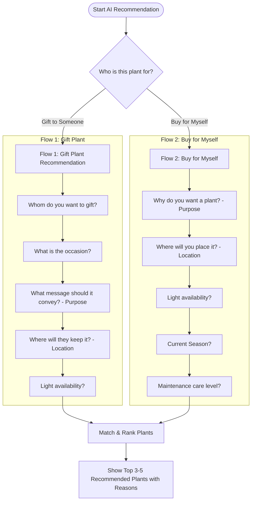
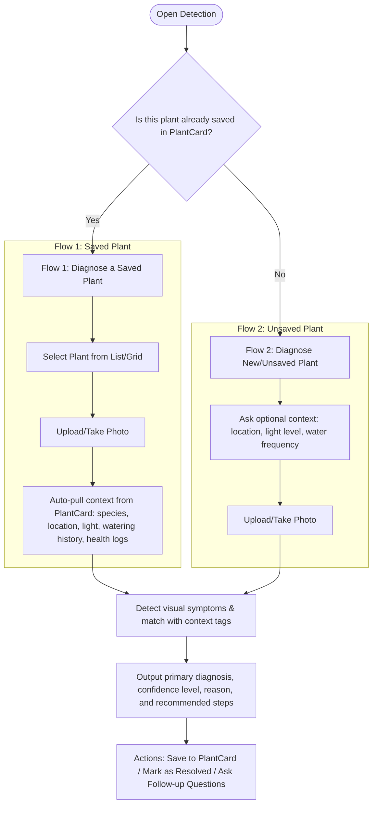
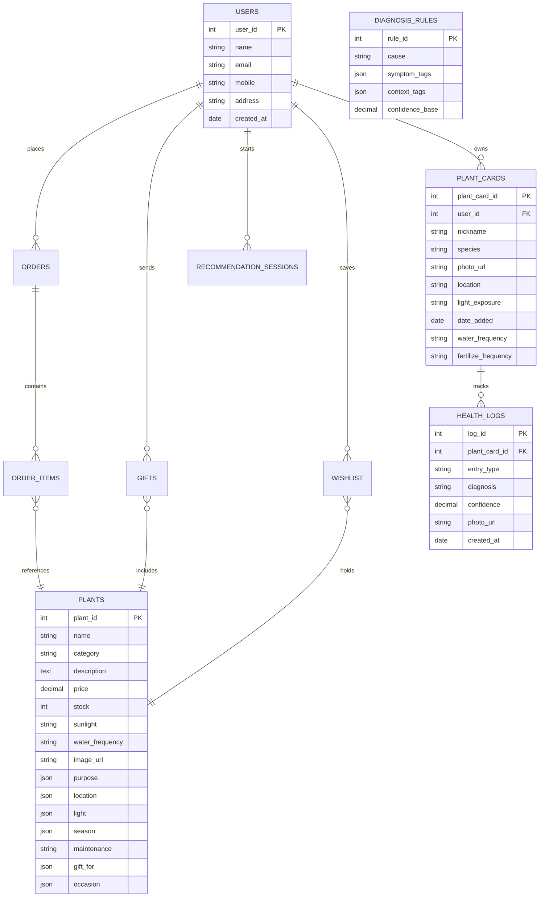

# GreenNest App Features & Technical Specification

GreenNest is a premium plant e-commerce, recommendation, and health monitoring application designed to guide users in choosing, purchasing, gifting, and maintaining their plants. It acts as both a **Plant Recommendation Assistant** and a **Plant Health Assistant**.

Below is a detailed analysis of the core application modules, user flows, database structures, and recommendation logic.

---

## 1. Plant Recommendation Assistant
Instead of showing a static, overwhelming list of plants, GreenNest implements a **rule-based recommendation engine** that matches plants to user needs based on answers to a few dynamic questions.

### Recommendation & Ranking Logic
Every plant in the shop is tagged with metadata covering:
*   `purpose` (e.g., Air Purification, Decoration, Good Luck, Stress Relief)
*   `location` (e.g., Bedroom, Living Room, Balcony, Office Desk, Garden, Kitchen, Terrace)
*   `light` (e.g., Low, Medium, Bright Indirect, Direct Sunlight)
*   `season` (e.g., Summer, Monsoon, Winter, All Season)
*   `maintenance` (e.g., Low, Medium, High)
*   `gift_for` (e.g., Friend, Mother, Father, Spouse)
*   `occasion` (e.g., Birthday, Anniversary, Housewarming, Festival)

#### Scoring System
When a user answers the questions, the engine calculates a matching score for each plant by summing the weights of matching attributes:

| Condition Matched | Score Weight |
| :--- | :--- |
| **Purpose** matched | `+5` |
| **Occasion** matched | `+5` |
| **Gift For** matched | `+5` |
| **Location** matched | `+3` |
| **Light** matched | `+3` |
| **Season** matched | `+2` |
| **Maintenance** matched | `+2` |

The plants are then sorted by their total score, and the top **3 to 5 recommendations** are presented along with customized bullet-point reasons (e.g., *"Thrives in low light"*, *"Removes indoor toxins"*).

#### Fallback (No Exact Match) Handling
To avoid showing a "No Plants Found" screen, the system progressively relaxes filters:
1.  Match `Purpose + Location + Light`
2.  If empty, match `Purpose + Location`
3.  If empty, match `Purpose` only
4.  If empty, show **Top Rated Plants**

---

## 2. Purchase & Gifting Workflows

Once recommendations are shown (or when browsing the store), users can proceed with buying, gifting, or sharing.

### Purchase Flow
A standard e-commerce funnel:
`Home` $\rightarrow$ `Browse Plants` $\rightarrow$ `Plant Details` $\rightarrow$ `Add to Cart` $\rightarrow$ `Checkout` $\rightarrow$ `Payment` $\rightarrow$ `Order Confirmation`

### Gift Flow
A tailored funnel that collects recipient information and coordinates gift logistics:
`Plant Details` $\rightarrow$ `Gift this Plant` $\rightarrow$ `Enter Friend Details` $\rightarrow$ `Add Gift Message` $\rightarrow$ `Select Delivery Date` $\rightarrow$ `Payment` $\rightarrow$ `Gift Order Confirmed`

*   **Recipient Details Collected**: Name, Mobile Number, Email (optional), and Shipping Address.
*   **Gift Details Collected**: Personal Message, Requested Delivery Date, and Gift Wrap preference (Yes/No).

### Suggest Plant to User (Social Sharing)
To drive viral growth and repeat traffic, GreenNest includes sharing features:
*   **Option 1: Direct Share**: A button on the Plant Details page ("Suggest to Friend") allows users to share details of an existing plant via WhatsApp, SMS, Email, or by copying a deep link. It auto-generates a friendly text (e.g., *"Hey! I found this beautiful Snake Plant. It is easy to maintain and perfect for indoor spaces. Check it here: <link>"*).
*   **Option 2: Mini recommendation questionnaire**: A simplified 3-question flow (`Location` $\rightarrow$ `Sunlight` $\rightarrow$ `Caring Time`) that friend-referrals can complete to quickly get 3 recommendations.

---

## 3. Plant Health Assistant (Disease Detection & PlantCard)

This module helps users diagnose unhealthy plants and keep track of their plant inventory over time.

### Diagnosis Logic
The system maps detected visual symptoms and environmental context to potential causes:

| Target Cause | Visual Symptom Tags | Context Tags |
| :--- | :--- | :--- |
| **Overwatering** | yellow leaves, soft stem, mushy soil | frequent watering, low light |
| **Underwatering** | dry crispy leaves, drooping | rare watering, direct sun |
| **Low light stress** | leggy growth, pale new leaves | low light, bedroom/office |
| **Pest infestation** | spots, webbing, holes in leaves | any |
| **Nutrient deficiency** | pale veins, slow growth | no fertilizing history |

#### Scoring Rules for Diagnosis:
*   Visual symptom matched: `+5`
*   Context tag matched: `+3`
*   PlantCard history matched: `+5`
*   Species-specific rule match: `+2`

The system presents the cause with the highest score as the primary diagnosis along with a calculated confidence percentage. Alternates are made available through a chat follow-up option ("Could it be something else?").

#### Fallback (No Confident Match) Handling:
If symptoms are unclear or context is missing:
1.  Try: `Symptom tags + Context tags`
2.  Relax: `Symptom tags only`
3.  Relax: Show general plant species care tips (if species is identifiable)
4.  Relax: Show a general *"common causes of yellowing"* checklist.
5.  *Rule*: Never display "Unable to diagnose". Always give actionable advice.

### PlantCard Module (My Plants)
A digital repository for the user's plants. When a diagnosis is saved, a PlantCard is created (or updated).
*   **Grid View**: Lists all saved plants with photos and nicknames.
*   **Detail View**: Displays:
    *   Plant photo & nickname
    *   Species & Date added
    *   Current location in home & Light exposure
    *   **Reminders**: Next watering due & Next fertilizing due
    *   **Health-log Timeline**: Chronological record of diagnoses, photo uploads, and care history.
    *   **Actions**: `Edit Info`, `Health Log`, `Diagnose`, `Remove`.

---

## 4. Database Schema
Based on the entity-relationship diagrams, the database stores tags inside JSON arrays to support dynamic attributes without requiring database schema changes.

